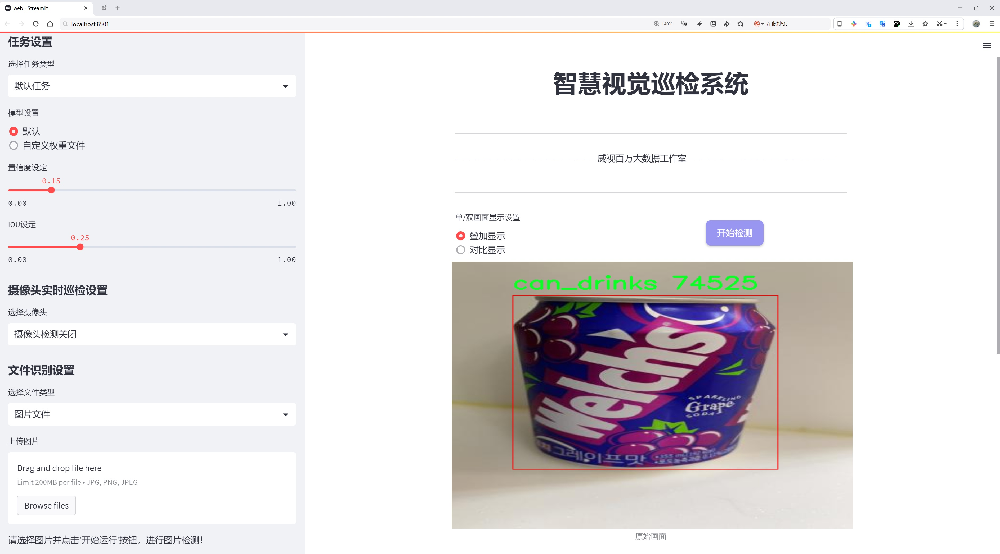
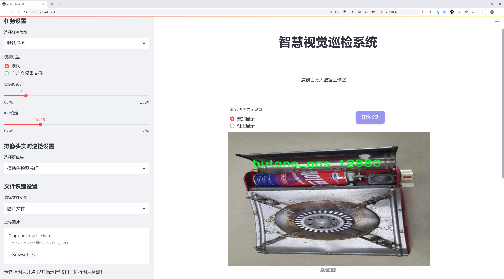
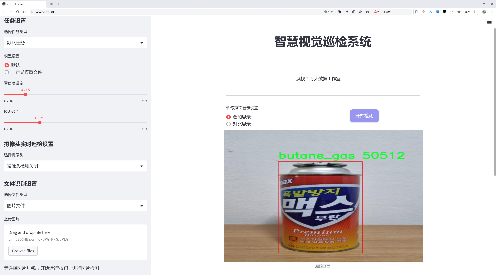
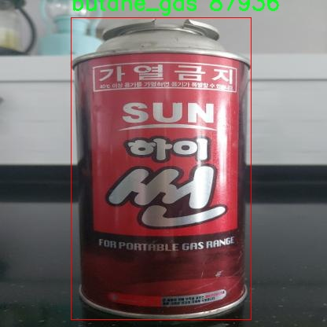
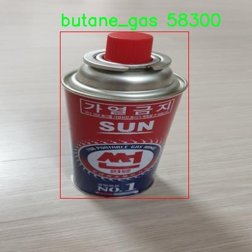
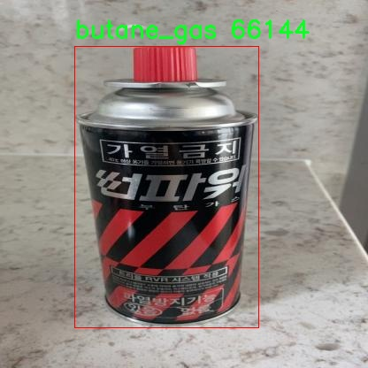
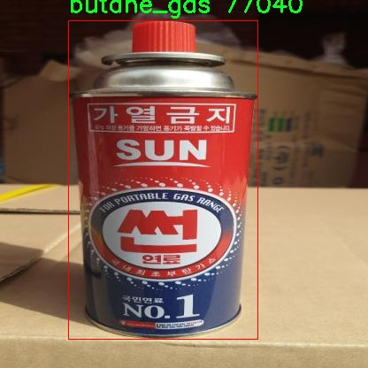
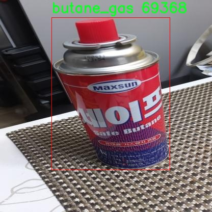

# 易燃气体检测检测系统源码分享
 # [一条龙教学YOLOV8标注好的数据集一键训练_70+全套改进创新点发刊_Web前端展示]

### 1.研究背景与意义

项目参考[AAAI Association for the Advancement of Artificial Intelligence](https://gitee.com/qunmasj/projects)

项目来源[AACV Association for the Advancement of Computer Vision](https://kdocs.cn/l/cszuIiCKVNis)

研究背景与意义

随着工业化进程的加快和城市化的不断推进，易燃气体的使用频率显著增加，随之而来的安全隐患也日益凸显。易燃气体，如丁烷（butane），广泛应用于家庭、商业和工业领域，然而其泄漏所带来的火灾和爆炸风险不容忽视。根据相关统计数据，因易燃气体泄漏引发的事故频繁发生，造成了严重的人员伤亡和财产损失。因此，开发高效、精准的易燃气体检测系统，成为了保障公共安全和提升生活质量的重要任务。

在这一背景下，计算机视觉技术的迅猛发展为易燃气体检测提供了新的解决方案。尤其是基于深度学习的目标检测算法，凭借其在图像识别和分类方面的卓越表现，逐渐成为研究的热点。YOLO（You Only Look Once）系列算法以其实时性和高准确率在目标检测领域取得了显著成果。YOLOv8作为该系列的最新版本，具备了更强的特征提取能力和更快的推理速度，能够有效应对复杂环境下的目标检测任务。然而，尽管YOLOv8在多种应用场景中表现优异，但在特定的易燃气体检测任务中，仍存在一定的局限性，例如对小目标的检测能力不足和对背景复杂场景的适应性不强。因此，基于改进YOLOv8的易燃气体检测系统的研究具有重要的现实意义。

本研究将基于一个包含2300张图像的数据集，专注于对易燃气体（如丁烷）及其相关物品（如气瓶、饮料罐、食品容器等）的检测。该数据集不仅涵盖了多种类别（共8类），还包含了50个不同的物体类别，提供了丰富的训练样本。这为改进YOLOv8算法提供了良好的基础，能够通过增强数据集的多样性和复杂性，提升模型的泛化能力和检测精度。通过对YOLOv8进行针对性的改进，如优化网络结构、调整损失函数、增强数据预处理等手段，期望能够有效提升模型在易燃气体检测中的表现。

此外，研究的意义还体现在其对社会安全的贡献。通过实现高效的易燃气体检测系统，可以及时发现潜在的安全隐患，减少事故发生的概率，保护人们的生命财产安全。同时，该系统的推广应用也将推动相关技术的发展，促进智能监控和安全防护领域的进步。

综上所述，基于改进YOLOv8的易燃气体检测系统的研究，不仅具有重要的学术价值，也具备显著的社会意义。通过该研究，期望能够为易燃气体的安全监测提供新的思路和方法，为构建安全、和谐的社会环境贡献力量。

### 2.图片演示







##### 注意：由于此博客编辑较早，上面“2.图片演示”和“3.视频演示”展示的系统图片或者视频可能为老版本，新版本在老版本的基础上升级如下：（实际效果以升级的新版本为准）

  （1）适配了YOLOV8的“目标检测”模型和“实例分割”模型，通过加载相应的权重（.pt）文件即可自适应加载模型。

  （2）支持“图片识别”、“视频识别”、“摄像头实时识别”三种识别模式。

  （3）支持“图片识别”、“视频识别”、“摄像头实时识别”三种识别结果保存导出，解决手动导出（容易卡顿出现爆内存）存在的问题，识别完自动保存结果并导出到tempDir中。

  （4）支持Web前端系统中的标题、背景图等自定义修改，后面提供修改教程。

  另外本项目提供训练的数据集和训练教程,暂不提供权重文件（best.pt）,需要您按照教程进行训练后实现图片演示和Web前端界面演示的效果。

### 3.视频演示

[3.1 视频演示](https://www.bilibili.com/video/BV1JVxFesEQy/)

### 4.数据集信息展示

##### 4.1 本项目数据集详细数据（类别数＆类别名）

nc: 7
names: ['bottle', 'butane_gas', 'can_drinks', 'food_container', 'gas_tank', 'scissor', 'torch']


##### 4.2 本项目数据集信息介绍

数据集信息展示

在现代安全监测系统中，易燃气体的检测尤为重要，尤其是在工业和家庭环境中。为此，我们构建了一个专门用于训练改进YOLOv8的易燃气体检测系统的数据集，命名为“butane_gas”。该数据集的设计旨在提高对多种易燃物品的识别能力，确保在潜在危险环境中能够及时发出警报，从而保障人们的生命安全和财产安全。

“butane_gas”数据集包含七个类别，分别是：瓶子（bottle）、丁烷气体（butane_gas）、饮料罐（can_drinks）、食品容器（food_container）、气罐（gas_tank）、剪刀（scissor）和火炬（torch）。这些类别的选择不仅涵盖了常见的易燃物品，还包括一些可能在事故中被误用或忽视的物品。通过这种多样化的类别设置，我们希望提高模型在实际应用中的适应性和准确性。

数据集中的每个类别都经过精心标注，确保在训练过程中，YOLOv8能够准确地识别和分类不同的物品。例如，丁烷气体作为主要的易燃气体，其识别对于防止火灾和爆炸至关重要。与此同时，其他类别如气罐和火炬也常常与易燃气体相关联，因此它们的准确识别同样不可或缺。通过将这些类别整合到一个数据集中，我们能够为模型提供丰富的上下文信息，帮助其在复杂环境中做出更为精准的判断。

在数据集的构建过程中，我们采用了多种数据采集方法，包括实地拍摄和模拟环境下的图像生成，以确保数据的多样性和真实性。每个类别的样本数量均衡，涵盖了不同的拍摄角度、光照条件和背景环境，以增强模型的鲁棒性。数据集中的图像不仅包含清晰的物体特征，还考虑到了物体在实际使用场景中的各种状态和位置，确保模型能够在真实世界中有效应用。

此外，为了进一步提升模型的性能，我们还对数据集进行了数据增强处理，包括旋转、缩放、翻转和颜色调整等。这些处理手段旨在模拟不同的环境变化，使得训练出来的模型能够更好地适应各种实际情况，从而提高其在真实场景中的检测准确率。

通过使用“butane_gas”数据集，我们期望能够训练出一个高效的易燃气体检测系统，能够在多种环境中实时监测并识别潜在的危险物品。随着技术的不断进步和数据集的不断完善，我们相信该系统将在未来的安全监测领域发挥重要作用，为人们的生活和工作提供更为可靠的保障。











### 5.全套项目环境部署视频教程（零基础手把手教学）

[5.1 环境部署教程链接（零基础手把手教学）](https://www.ixigua.com/7404473917358506534?logTag=c807d0cbc21c0ef59de5)


[5.2 安装Python虚拟环境创建和依赖库安装视频教程链接（零基础手把手教学）](https://www.ixigua.com/7404474678003106304?logTag=1f1041108cd1f708b01a)

### 6.手把手YOLOV8训练视频教程（零基础小白有手就能学会）

[6.1 手把手YOLOV8训练视频教程（零基础小白有手就能学会）](https://www.ixigua.com/7404477157818401292?logTag=d31a2dfd1983c9668658)

### 7.70+种全套YOLOV8创新点代码加载调参视频教程（一键加载写好的改进模型的配置文件）

[7.1 70+种全套YOLOV8创新点代码加载调参视频教程（一键加载写好的改进模型的配置文件）](https://www.ixigua.com/7404478314661806627?logTag=29066f8288e3f4eea3a4)

### 8.70+种全套YOLOV8创新点原理讲解（非科班也可以轻松写刊发刊，V10版本正在科研待更新）

由于篇幅限制，每个创新点的具体原理讲解就不一一展开，具体见下列网址中的创新点对应子项目的技术原理博客网址【Blog】：


[8.1 70+种全套YOLOV8创新点原理讲解链接](https://gitee.com/qunmasj/good)

### 9.系统功能展示（检测对象为举例，实际内容以本项目数据集为准）

图9.1.系统支持检测结果表格显示

  图9.2.系统支持置信度和IOU阈值手动调节

  图9.3.系统支持自定义加载权重文件best.pt(需要你通过步骤5中训练获得)

  图9.4.系统支持摄像头实时识别

  图9.5.系统支持图片识别

  图9.6.系统支持视频识别

  图9.7.系统支持识别结果文件自动保存

  图9.8.系统支持Excel导出检测结果数据


### 10.原始YOLOV8算法原理

原始YOLOv8算法原理

YOLOv8是YOLO系列中的最新作品，标志着目标检测领域的一次重要进步。与前一代YOLOv5相比，YOLOv8在检测精度和速度上都实现了显著的提升，充分展现了深度学习技术在计算机视觉中的潜力。YOLOv8的设计理念是为了适应不同的应用场景，因此推出了包括YOLOv8n、YOLOv8s、YOLOv8m、YOLOv8l和YOLOv8x在内的五种不同规模的模型。每种模型在网络深度和参数量上有所不同，用户可以根据实际需求选择合适的版本。例如，YOLOv8n是参数量最小且检测速度最快的版本，适合对实时性要求较高的应用场景。

YOLOv8的网络结构主要由四个部分组成：输入端、骨干网络、颈部网络和头部网络。输入端的设计采用了马赛克数据增强、自适应锚框计算和自适应灰度填充等技术，以提高模型的鲁棒性和适应性。马赛克数据增强通过将多张图像拼接在一起，生成新的训练样本，从而增加了训练数据的多样性。自适应锚框计算则通过分析数据集中的目标分布，动态调整锚框的尺寸和比例，使得模型在不同目标尺度下的检测能力得到增强。

在骨干网络部分，YOLOv8引入了C2f模块和SPPF（Spatial Pyramid Pooling Fusion）结构。C2f模块是对残差特征进行学习的主要模块，它基于YOLOv7的ELAN结构，通过更多的分支跨层连接，增强了模型的梯度流，提升了特征表示能力。这种设计使得网络能够更有效地提取和融合不同层次的特征信息。SPPF模块则通过空间金字塔池化的方式，进一步提高了模型的计算速度和特征提取能力，使得YOLOv8在处理高分辨率图像时依然能够保持高效的性能。

颈部网络采用了路径聚合网络（PAN）结构，旨在加强对不同缩放尺度对象的特征融合能力。PAN通过将不同层次的特征进行有效融合，使得模型在面对多尺度目标时，能够更好地捕捉到目标的细节信息。这种特征融合策略使得YOLOv8在处理复杂场景时，能够保持较高的检测精度。

头部网络是YOLOv8的关键部分，它将分类和检测过程进行了有效的解耦。头部网络主要包括损失计算和目标检测框筛选两个重要环节。在损失计算过程中，YOLOv8采用了Task-Aligned Assigner分配策略，根据分类与回归的分数加权结果选择正样本。这种策略使得模型在训练过程中能够更好地平衡正负样本的比例，提高了训练的效率和效果。损失计算涵盖了分类和回归两个分支，其中分类分支使用了二元交叉熵损失（Binary Cross Entropy Loss），而回归分支则结合了分布焦点损失（Distribution Focal Loss）和完全交并比损失函数（Complete Intersection over Union Loss），以提升模型对边界框预测的精准性。

相较于上一代版本，YOLOv8在多个方面进行了重要的改进。首先，新的骨干网络和头部网络的设计，使得YOLOv8在特征提取和目标检测的过程中，能够实现更高的效率和准确性。C2f结构的引入，替代了YOLOv5中的C3结构，增强了模型的梯度流和特征表示能力。同时，YOLOv8在头部网络中将分类和检测头分离，采用了当前主流的解耦头结构，进一步提高了模型的灵活性和适应性。此外，YOLOv8还引入了无锚框检测头（Anchor-Free），减少了锚框预测的数量，加速了非最大抑制（Non-Maximum Suppression，NMS）的过程，从而提升了整体的检测速度。

YOLOv8n作为YOLOv8系列中的轻量化版本，采用了更加精简的C2f模块，优化了卷积层的结构，并在特征融合层减少了降采样层的数量。这些设计使得YOLOv8n在保持高效性能的同时，进一步降低了模型的复杂度，适合在资源受限的环境中应用。特征融合网络结合了特征金字塔网络（FPN）和路径聚合网络（PAN），通过高效的双向跨尺度连接和加权特征融合，提升了模型对不同尺度特征信息的提取速度。

综上所述，YOLOv8作为YOLO系列的最新成果，通过一系列创新的设计和优化，显著提升了目标检测的精度和速度。其在输入端、骨干网络、颈部网络和头部网络的全面改进，使得YOLOv8能够在复杂的实际应用中，展现出卓越的性能和灵活性。这些特性使得YOLOv8在目标检测领域中，成为了一个极具竞争力的选择，推动了计算机视觉技术的进一步发展。


### 11.项目核心源码讲解（再也不用担心看不懂代码逻辑）

#### 11.1 70+种YOLOv8算法改进源码大全和调试加载训练教程（非必要）\ultralytics\utils\callbacks\wb.py

以下是经过简化和注释的核心代码部分，保留了最重要的功能，并对每个部分进行了详细的中文注释：

```python
# 导入必要的库
from ultralytics.utils import SETTINGS, TESTS_RUNNING
from ultralytics.utils.torch_utils import model_info_for_loggers
import numpy as np
import pandas as pd

# 尝试导入wandb库并进行基本的设置检查
try:
    assert not TESTS_RUNNING  # 确保不是在测试环境中
    assert SETTINGS['wandb'] is True  # 确保wandb集成已启用
    import wandb as wb
    assert hasattr(wb, '__version__')  # 确保wandb库是有效的

    _processed_plots = {}  # 用于记录已处理的图表

except (ImportError, AssertionError):
    wb = None  # 如果导入失败，设置wb为None


def _custom_table(x, y, classes, title='Precision Recall Curve', x_title='Recall', y_title='Precision'):
    """
    创建并记录自定义的精确度-召回率曲线可视化。
    
    参数:
        x (List): x轴的值，长度为N。
        y (List): y轴的值，长度为N。
        classes (List): 每个点的类别标签，长度为N。
        title (str): 图表标题，默认为'Precision Recall Curve'。
        x_title (str): x轴标签，默认为'Recall'。
        y_title (str): y轴标签，默认为'Precision'。

    返回:
        (wandb.Object): 适合记录的wandb对象，展示自定义的度量可视化。
    """
    df = pd.DataFrame({'class': classes, 'y': y, 'x': x}).round(3)  # 创建数据框
    fields = {'x': 'x', 'y': 'y', 'class': 'class'}
    string_fields = {'title': title, 'x-axis-title': x_title, 'y-axis-title': y_title}
    return wb.plot_table('wandb/area-under-curve/v0',
                         wb.Table(dataframe=df),
                         fields=fields,
                         string_fields=string_fields)


def _plot_curve(x, y, names=None, id='precision-recall', title='Precision Recall Curve', x_title='Recall', y_title='Precision', num_x=100, only_mean=False):
    """
    记录度量曲线可视化。

    参数:
        x (np.ndarray): x轴的数据点，长度为N。
        y (np.ndarray): y轴的数据点，形状为CxN，C为类别数。
        names (list): 类别名称，长度为C。
        id (str): 记录数据的唯一标识符，默认为'precision-recall'。
        title (str): 可视化图表的标题，默认为'Precision Recall Curve'。
        x_title (str): x轴标签，默认为'Recall'。
        y_title (str): y轴标签，默认为'Precision'。
        num_x (int): 可视化的插值数据点数量，默认为100。
        only_mean (bool): 是否仅绘制均值曲线的标志，默认为True。
    """
    if names is None:
        names = []  # 如果没有提供类别名称，则初始化为空列表
    x_new = np.linspace(x[0], x[-1], num_x).round(5)  # 创建新的x值

    # 创建用于记录的数组
    x_log = x_new.tolist()
    y_log = np.interp(x_new, x, np.mean(y, axis=0)).round(3).tolist()  # 插值计算y值

    if only_mean:
        # 仅记录均值曲线
        table = wb.Table(data=list(zip(x_log, y_log)), columns=[x_title, y_title])
        wb.run.log({title: wb.plot.line(table, x_title, y_title, title=title)})
    else:
        # 记录每个类别的曲线
        classes = ['mean'] * len(x_log)
        for i, yi in enumerate(y):
            x_log.extend(x_new)  # 添加新的x值
            y_log.extend(np.interp(x_new, x, yi))  # 对y进行插值
            classes.extend([names[i]] * len(x_new))  # 添加类别名称
        wb.log({id: _custom_table(x_log, y_log, classes, title, x_title, y_title)}, commit=False)


def on_fit_epoch_end(trainer):
    """在每个训练周期结束时记录训练指标和模型信息。"""
    wb.run.log(trainer.metrics, step=trainer.epoch + 1)  # 记录训练指标
    # 记录图表
    _log_plots(trainer.plots, step=trainer.epoch + 1)
    _log_plots(trainer.validator.plots, step=trainer.epoch + 1)
    if trainer.epoch == 0:
        wb.run.log(model_info_for_loggers(trainer), step=trainer.epoch + 1)  # 记录模型信息


def on_train_end(trainer):
    """在训练结束时保存最佳模型作为artifact。"""
    _log_plots(trainer.validator.plots, step=trainer.epoch + 1)
    _log_plots(trainer.plots, step=trainer.epoch + 1)
    art = wb.Artifact(type='model', name=f'run_{wb.run.id}_model')  # 创建artifact
    if trainer.best.exists():
        art.add_file(trainer.best)  # 添加最佳模型文件
        wb.run.log_artifact(art, aliases=['best'])  # 记录artifact
    wb.run.finish()  # 结束wandb运行


# 回调函数字典
callbacks = {
    'on_fit_epoch_end': on_fit_epoch_end,
    'on_train_end': on_train_end
} if wb else {}
```

### 代码分析
1. **导入和初始化**：导入必要的库，并检查`wandb`的集成是否可用。
2. **自定义表格和曲线绘制**：定义了两个主要的函数`_custom_table`和`_plot_curve`，用于创建和记录精确度-召回率曲线的可视化。
3. **训练过程中的回调**：定义了在训练结束时和每个训练周期结束时的回调函数，记录训练指标和模型信息，并在训练结束时保存最佳模型。
4. **回调字典**：根据`wandb`是否可用，定义了回调函数的字典，以便在训练过程中自动调用。 

以上是代码的核心部分及其详细注释，保留了主要功能和逻辑。

这个文件是一个用于集成WandB（Weights and Biases）工具的回调模块，主要用于在训练YOLOv8模型时记录和可视化训练过程中的各种指标和图表。文件中首先导入了一些必要的库，并进行了基本的错误处理，以确保WandB库的可用性。

文件中定义了几个主要的函数。首先是`_custom_table`函数，它用于创建和记录一个自定义的精确度-召回曲线（Precision-Recall Curve）可视化。该函数接受x轴和y轴的数据、类别标签以及图表的标题等参数，并将这些数据整理成一个Pandas DataFrame，然后通过WandB的API生成一个可记录的图表对象。

接下来是`_plot_curve`函数，它用于生成并记录一个指标曲线的可视化。这个函数可以处理多个类别的数据，并根据输入的参数决定是否只绘制平均曲线。它会创建新的x值并对y值进行插值，以便生成平滑的曲线。最终，调用`_custom_table`函数将生成的曲线记录到WandB中。

`_log_plots`函数则负责记录输入字典中的图表，如果这些图表在指定的步骤中尚未记录过。它会检查每个图表的时间戳，以避免重复记录。

在训练的不同阶段，文件中定义了一些回调函数。`on_pretrain_routine_start`函数在预训练开始时被调用，用于初始化WandB项目。`on_fit_epoch_end`函数在每个训练周期结束时记录训练指标和模型信息。`on_train_epoch_end`函数则在每个训练周期结束时记录损失和学习率，并在特定周期记录图表。最后，`on_train_end`函数在训练结束时保存最佳模型，并记录验证指标的曲线。

最后，文件中定义了一个回调字典，将上述回调函数与相应的事件关联起来，以便在WandB可用时进行记录。如果WandB不可用，则该字典为空。整个模块的设计旨在帮助用户在训练YOLOv8模型时，方便地监控和记录模型的性能表现。

#### 11.2 predict.py

以下是经过简化和注释的核心代码部分：

```python
# 导入必要的模块
from ultralytics.engine.predictor import BasePredictor
from ultralytics.engine.results import Results
from ultralytics.utils import ops

class DetectionPredictor(BasePredictor):
    """
    扩展自 BasePredictor 类的检测模型预测类。
    该类用于处理目标检测模型的预测结果。
    """

    def postprocess(self, preds, img, orig_imgs):
        """
        对预测结果进行后处理，并返回 Results 对象的列表。

        参数:
        preds: 模型的预测结果
        img: 输入图像
        orig_imgs: 原始图像列表或张量

        返回:
        results: 包含处理后结果的 Results 对象列表
        """
        # 应用非极大值抑制（NMS）来过滤预测框
        preds = ops.non_max_suppression(
            preds,
            self.args.conf,  # 置信度阈值
            self.args.iou,    # IOU 阈值
            agnostic=self.args.agnostic_nms,  # 是否类别无关的 NMS
            max_det=self.args.max_det,  # 最大检测框数量
            classes=self.args.classes,    # 需要检测的类别
        )

        # 如果输入的原始图像不是列表，则将其转换为 numpy 数组
        if not isinstance(orig_imgs, list):
            orig_imgs = ops.convert_torch2numpy_batch(orig_imgs)

        results = []  # 初始化结果列表
        for i, pred in enumerate(preds):
            orig_img = orig_imgs[i]  # 获取对应的原始图像
            # 将预测框的坐标从缩放后的图像空间转换回原始图像空间
            pred[:, :4] = ops.scale_boxes(img.shape[2:], pred[:, :4], orig_img.shape)
            img_path = self.batch[0][i]  # 获取图像路径
            # 创建 Results 对象并添加到结果列表
            results.append(Results(orig_img, path=img_path, names=self.model.names, boxes=pred))
        
        return results  # 返回处理后的结果列表
```

### 代码注释说明：
1. **类的定义**：`DetectionPredictor` 类继承自 `BasePredictor`，用于处理目标检测模型的预测。
2. **postprocess 方法**：该方法负责对模型的预测结果进行后处理，包括应用非极大值抑制（NMS）和坐标转换。
3. **非极大值抑制**：通过 `ops.non_max_suppression` 函数来减少重叠的预测框，提高检测的准确性。
4. **图像转换**：如果原始图像不是列表，则将其转换为 numpy 数组，以便后续处理。
5. **结果构建**：遍历每个预测结果，调整预测框的坐标，并将结果存储在 `Results` 对象中，最终返回所有结果的列表。

这个程序文件 `predict.py` 是一个用于目标检测的预测模块，基于 Ultralytics YOLO（You Only Look Once）模型。它通过继承 `BasePredictor` 类，扩展了预测功能，主要用于处理图像并返回检测结果。

在文件中，首先导入了必要的模块，包括 `BasePredictor`、`Results` 和一些操作工具 `ops`。`DetectionPredictor` 类是该文件的核心，提供了对检测模型的预测功能。

类的文档字符串中给出了一个示例，展示了如何使用 `DetectionPredictor` 类进行预测。用户可以通过传入模型路径和数据源来创建预测器实例，并调用 `predict_cli()` 方法进行预测。

`postprocess` 方法是该类的关键部分，负责对模型的预测结果进行后处理。它接收三个参数：`preds`（模型的预测结果）、`img`（输入图像）和 `orig_imgs`（原始图像）。在该方法中，首先调用 `ops.non_max_suppression` 函数对预测结果进行非极大值抑制，以去除冗余的检测框，确保每个目标只保留一个最佳的检测框。这个过程使用了一些参数，如置信度阈值、IOU（Intersection over Union）阈值、是否进行类别无关的 NMS 处理、最大检测框数量和特定类别。

接下来，方法检查 `orig_imgs` 是否为列表。如果不是，说明输入图像是一个 PyTorch 张量，此时需要将其转换为 NumPy 数组。然后，方法会遍历每个预测结果，并根据原始图像的尺寸调整检测框的位置。最后，将每个原始图像、图像路径、模型名称和预测框封装成 `Results` 对象，并将这些对象添加到结果列表中。

最终，`postprocess` 方法返回一个包含所有检测结果的列表。这些结果可以用于后续的分析或可视化。整个程序文件展示了如何利用 YOLO 模型进行高效的目标检测，并提供了必要的后处理步骤以确保检测结果的准确性和可用性。

#### 11.3 ui.py

以下是经过简化和注释的核心代码部分：

```python
import sys
import subprocess

def run_script(script_path):
    """
    使用当前 Python 环境运行指定的脚本。

    Args:
        script_path (str): 要运行的脚本路径

    Returns:
        None
    """
    # 获取当前 Python 解释器的路径
    python_path = sys.executable

    # 构建运行命令，使用 streamlit 运行指定的脚本
    command = f'"{python_path}" -m streamlit run "{script_path}"'

    # 执行命令并等待其完成
    result = subprocess.run(command, shell=True)
    
    # 检查命令执行的返回码，如果不为0，则表示出错
    if result.returncode != 0:
        print("脚本运行出错。")

# 程序入口
if __name__ == "__main__":
    # 指定要运行的脚本路径
    script_path = "web.py"  # 这里可以直接指定脚本名

    # 调用函数运行脚本
    run_script(script_path)
```

### 代码注释说明：
1. **导入模块**：
   - `sys`：用于获取当前 Python 解释器的路径。
   - `subprocess`：用于执行外部命令。

2. **`run_script` 函数**：
   - 该函数接受一个参数 `script_path`，表示要运行的 Python 脚本的路径。
   - 使用 `sys.executable` 获取当前 Python 解释器的路径。
   - 构建一个命令字符串，用于调用 `streamlit` 运行指定的脚本。
   - 使用 `subprocess.run` 执行构建的命令，并等待其完成。
   - 检查命令的返回码，如果返回码不为0，表示脚本运行出错，打印错误信息。

3. **程序入口**：
   - 使用 `if __name__ == "__main__":` 确保只有在直接运行该脚本时才会执行以下代码。
   - 指定要运行的脚本路径为 `web.py`。
   - 调用 `run_script` 函数来执行指定的脚本。

这个程序文件的主要功能是使用当前的 Python 环境来运行一个指定的脚本，具体来说是一个名为 `web.py` 的脚本。程序首先导入了必要的模块，包括 `sys`、`os` 和 `subprocess`，以及一个自定义的路径处理模块 `abs_path`。

在 `run_script` 函数中，首先获取当前 Python 解释器的路径，这通过 `sys.executable` 实现。接着，构建一个命令字符串，该命令使用 `streamlit` 来运行指定的脚本。这里使用了 Python 的 `subprocess` 模块来执行这个命令。`subprocess.run` 方法会在一个新的 shell 中执行命令，并返回一个结果对象。通过检查 `result.returncode`，程序可以判断脚本是否成功运行。如果返回码不为零，表示脚本运行出错，程序会输出一条错误信息。

在文件的最后部分，使用 `if __name__ == "__main__":` 来确保当该文件作为主程序运行时才会执行后续代码。这里指定了要运行的脚本路径为 `web.py`，并调用 `run_script` 函数来执行该脚本。

总的来说，这个程序的功能是封装了一个简单的命令行接口，方便用户在当前 Python 环境中运行指定的 Streamlit 脚本，并处理可能出现的错误。

#### 11.4 70+种YOLOv8算法改进源码大全和调试加载训练教程（非必要）\ultralytics\nn\extra_modules\orepa.py

以下是代码中最核心的部分，并附上详细的中文注释：

```python
import torch
import torch.nn as nn
import torch.nn.functional as F
import numpy as np

# 定义OREPA模块
class OREPA(nn.Module):
    def __init__(self, in_channels, out_channels, kernel_size=3, stride=1, padding=None, groups=1, dilation=1, act=True):
        super(OREPA, self).__init__()
        
        # 初始化参数
        self.in_channels = in_channels
        self.out_channels = out_channels
        self.kernel_size = kernel_size
        self.stride = stride
        self.groups = groups
        self.dilation = dilation
        
        # 选择激活函数
        self.nonlinear = nn.ReLU() if act else nn.Identity()
        
        # 初始化卷积层的权重
        self.weight_orepa_origin = nn.Parameter(torch.Tensor(out_channels, in_channels // groups, kernel_size, kernel_size))
        nn.init.kaiming_uniform_(self.weight_orepa_origin, a=0.0)
        
        # 初始化其他卷积层的权重
        self.weight_orepa_avg_conv = nn.Parameter(torch.Tensor(out_channels, in_channels // groups, 1, 1))
        nn.init.kaiming_uniform_(self.weight_orepa_avg_conv, a=0.0)
        
        self.weight_orepa_1x1 = nn.Parameter(torch.Tensor(out_channels, in_channels // groups, 1, 1))
        nn.init.kaiming_uniform_(self.weight_orepa_1x1, a=0.0)
        
        # 其他参数初始化
        self.vector = nn.Parameter(torch.Tensor(6, out_channels))
        self.fre_init()  # 自定义初始化

    def fre_init(self):
        # 自定义初始化方法
        prior_tensor = torch.Tensor(self.out_channels, self.kernel_size, self.kernel_size)
        half_fg = self.out_channels / 2
        for i in range(self.out_channels):
            for h in range(3):
                for w in range(3):
                    if i < half_fg:
                        prior_tensor[i, h, w] = np.cos(np.pi * (h + 0.5) * (i + 1) / 3)
                    else:
                        prior_tensor[i, h, w] = np.cos(np.pi * (w + 0.5) * (i + 1 - half_fg) / 3)
        self.register_buffer('weight_orepa_prior', prior_tensor)

    def weight_gen(self):
        # 生成权重
        weight_orepa_origin = self.weight_orepa_origin
        weight_orepa_avg = self.weight_orepa_avg_conv
        weight_orepa_1x1 = self.weight_orepa_1x1
        
        # 权重组合
        weight = weight_orepa_origin + weight_orepa_avg + weight_orepa_1x1
        return weight

    def forward(self, inputs):
        # 前向传播
        weight = self.weight_gen()  # 生成权重
        out = F.conv2d(inputs, weight, stride=self.stride, padding=self.kernel_size // 2, dilation=self.dilation, groups=self.groups)
        return self.nonlinear(out)  # 应用激活函数

# 定义RepVGGBlock_OREPA模块
class RepVGGBlock_OREPA(nn.Module):
    def __init__(self, in_channels, out_channels, kernel_size=3, stride=1, padding=None, groups=1, act=True):
        super(RepVGGBlock_OREPA, self).__init__()
        
        # 初始化参数
        self.in_channels = in_channels
        self.out_channels = out_channels
        self.groups = groups
        
        # 创建OREPA模块
        self.rbr_dense = OREPA(in_channels, out_channels, kernel_size=kernel_size, stride=stride, groups=groups)
        self.rbr_1x1 = nn.Conv2d(in_channels, out_channels, kernel_size=1, stride=stride, groups=groups, bias=False)

    def forward(self, inputs):
        # 前向传播
        out1 = self.rbr_dense(inputs)  # OREPA模块的输出
        out2 = self.rbr_1x1(inputs)    # 1x1卷积的输出
        out = out1 + out2              # 合并输出
        return out

# 其他模块省略...
```

### 代码核心部分说明：
1. **OREPA类**：实现了一个特殊的卷积模块，包含多个不同类型的卷积权重。它通过不同的卷积核组合生成最终的卷积权重。
2. **fre_init方法**：用于初始化一些特殊的权重，以便在训练过程中保持一定的特性。
3. **weight_gen方法**：生成最终的卷积权重，结合了多个卷积层的权重。
4. **RepVGGBlock_OREPA类**：将OREPA模块与1x1卷积结合，形成一个复合卷积块，便于在网络中使用。

以上是代码的核心部分及其详细注释，便于理解其结构和功能。

该程序文件定义了一些用于改进YOLOv8算法的模块，主要包括OREPA、OREPA_LargeConv、ConvBN、OREPA_3x3_RepVGG和RepVGGBlock_OREPA等类。这些模块的设计旨在提高卷积神经网络的性能和效率。

首先，OREPA类是一个自定义的卷积模块，支持多种参数配置，包括输入和输出通道数、卷积核大小、步幅、填充、分组卷积等。它的构造函数中定义了多个卷积核的权重，并使用Kaiming均匀分布进行初始化。该类的核心功能是生成加权卷积核，并在前向传播中使用这些权重进行卷积操作。

在OREPA类中，`weight_gen`方法用于生成最终的卷积权重，它结合了多个分支的权重，并通过线性组合来生成最终的卷积核。`forward`方法则实现了前向传播，执行卷积操作并应用非线性激活函数。

OREPA_LargeConv类是对OREPA的扩展，允许使用更大的卷积核。它通过堆叠多个OREPA模块来实现深层卷积，进一步提高模型的表达能力。

ConvBN类则是一个简单的卷积层与批归一化层的组合，提供了一个可选的非线性激活函数。它在前向传播中首先执行卷积操作，然后应用批归一化和激活函数。

OREPA_3x3_RepVGG类实现了3x3卷积的RepVGG结构，支持多种分支的组合，增强了模型的灵活性和性能。它同样包含权重生成和前向传播的逻辑。

最后，RepVGGBlock_OREPA类将上述模块组合在一起，形成一个完整的RepVGG块。它支持可选的SE注意力机制，并在前向传播中将不同分支的输出相加，形成最终的输出。

整体而言，这个文件提供了一种灵活且高效的方式来构建和训练改进的YOLOv8模型，通过模块化设计使得不同的卷积结构和参数配置可以方便地组合和使用。

#### 11.5 train.py

以下是代码中最核心的部分，并附上详细的中文注释：

```python
class DetectionTrainer(BaseTrainer):
    """
    DetectionTrainer类扩展了BaseTrainer类，用于基于检测模型的训练。
    """

    def build_dataset(self, img_path, mode="train", batch=None):
        """
        构建YOLO数据集。

        参数:
            img_path (str): 包含图像的文件夹路径。
            mode (str): 模式，`train`表示训练模式，`val`表示验证模式，用户可以为每种模式自定义不同的增强。
            batch (int, optional): 批次大小，仅用于`rect`模式。默认为None。
        """
        gs = max(int(de_parallel(self.model).stride.max() if self.model else 0), 32)
        return build_yolo_dataset(self.args, img_path, batch, self.data, mode=mode, rect=mode == "val", stride=gs)

    def get_dataloader(self, dataset_path, batch_size=16, rank=0, mode="train"):
        """构造并返回数据加载器。"""
        assert mode in ["train", "val"]  # 确保模式是训练或验证
        with torch_distributed_zero_first(rank):  # 如果使用分布式数据并行，只初始化数据集一次
            dataset = self.build_dataset(dataset_path, mode, batch_size)
        shuffle = mode == "train"  # 训练模式下打乱数据
        if getattr(dataset, "rect", False) and shuffle:
            LOGGER.warning("WARNING ⚠️ 'rect=True'与DataLoader的shuffle不兼容，设置shuffle=False")
            shuffle = False
        workers = self.args.workers if mode == "train" else self.args.workers * 2  # 设置工作线程数
        return build_dataloader(dataset, batch_size, workers, shuffle, rank)  # 返回数据加载器

    def preprocess_batch(self, batch):
        """对一批图像进行预处理，包括缩放和转换为浮点数。"""
        batch["img"] = batch["img"].to(self.device, non_blocking=True).float() / 255  # 将图像转换为浮点数并归一化
        if self.args.multi_scale:  # 如果启用多尺度
            imgs = batch["img"]
            sz = (
                random.randrange(self.args.imgsz * 0.5, self.args.imgsz * 1.5 + self.stride)
                // self.stride
                * self.stride
            )  # 随机选择图像大小
            sf = sz / max(imgs.shape[2:])  # 计算缩放因子
            if sf != 1:  # 如果缩放因子不为1
                ns = [
                    math.ceil(x * sf / self.stride) * self.stride for x in imgs.shape[2:]
                ]  # 计算新的形状
                imgs = nn.functional.interpolate(imgs, size=ns, mode="bilinear", align_corners=False)  # 进行插值缩放
            batch["img"] = imgs  # 更新批次图像
        return batch

    def get_model(self, cfg=None, weights=None, verbose=True):
        """返回YOLO检测模型。"""
        model = DetectionModel(cfg, nc=self.data["nc"], verbose=verbose and RANK == -1)  # 创建检测模型
        if weights:
            model.load(weights)  # 加载权重
        return model

    def get_validator(self):
        """返回用于YOLO模型验证的DetectionValidator。"""
        self.loss_names = "box_loss", "cls_loss", "dfl_loss"  # 定义损失名称
        return yolo.detect.DetectionValidator(
            self.test_loader, save_dir=self.save_dir, args=copy(self.args), _callbacks=self.callbacks
        )

    def plot_training_samples(self, batch, ni):
        """绘制带有注释的训练样本。"""
        plot_images(
            images=batch["img"],
            batch_idx=batch["batch_idx"],
            cls=batch["cls"].squeeze(-1),
            bboxes=batch["bboxes"],
            paths=batch["im_file"],
            fname=self.save_dir / f"train_batch{ni}.jpg",
            on_plot=self.on_plot,
        )
```

### 代码核心部分说明：
1. **DetectionTrainer类**：该类是用于训练YOLO检测模型的核心类，继承自BaseTrainer。
2. **build_dataset方法**：构建YOLO数据集，支持训练和验证模式。
3. **get_dataloader方法**：构造数据加载器，支持多线程和数据打乱。
4. **preprocess_batch方法**：对输入的图像批次进行预处理，包括归一化和多尺度调整。
5. **get_model方法**：返回YOLO检测模型，并可选择加载预训练权重。
6. **get_validator方法**：返回用于模型验证的验证器。
7. **plot_training_samples方法**：绘制训练样本及其注释，便于可视化训练过程。

这个程序文件 `train.py` 是一个用于训练 YOLO（You Only Look Once）目标检测模型的实现，基于 Ultralytics 提供的框架。程序首先导入了一些必要的库和模块，包括数学运算、随机数生成、深度学习相关的 PyTorch 库以及 Ultralytics 的数据处理和模型训练工具。

在程序中，定义了一个名为 `DetectionTrainer` 的类，它继承自 `BaseTrainer` 类，专门用于基于检测模型的训练。该类的主要功能包括构建数据集、获取数据加载器、预处理图像批次、设置模型属性、获取模型、获取验证器、记录损失、显示训练进度、绘制训练样本和绘制训练指标等。

`build_dataset` 方法用于构建 YOLO 数据集，接收图像路径、模式（训练或验证）和批次大小作为参数。它会根据模型的步幅和其他参数来生成适合的训练数据集。

`get_dataloader` 方法用于构建并返回数据加载器，确保在分布式训练时只初始化一次数据集。它会根据训练或验证模式来设置数据加载的方式，包括是否打乱数据。

`preprocess_batch` 方法对图像批次进行预处理，包括将图像缩放到适当的大小并转换为浮点数格式，以便于后续的模型训练。

`set_model_attributes` 方法用于设置模型的属性，包括类别数量和类别名称，以确保模型能够正确处理数据集中的目标。

`get_model` 方法返回一个 YOLO 检测模型实例，并可选择加载预训练权重。

`get_validator` 方法返回一个用于验证 YOLO 模型的验证器，能够计算并记录损失。

`label_loss_items` 方法用于返回带有标签的训练损失项字典，以便于监控训练过程中的损失变化。

`progress_string` 方法生成一个格式化的字符串，用于显示训练进度，包括当前的 epoch、GPU 内存使用情况、损失值、实例数量和图像大小等信息。

`plot_training_samples` 方法用于绘制训练样本及其标注，便于可视化训练数据的质量。

最后，`plot_metrics` 和 `plot_training_labels` 方法分别用于绘制训练过程中的指标和创建带标签的训练图，以帮助分析模型的训练效果。

整体来看，这个程序文件实现了 YOLO 模型训练的各个环节，提供了从数据加载、预处理到模型训练和验证的完整流程，适合用于目标检测任务的研究和应用。

#### 11.6 70+种YOLOv8算法改进源码大全和调试加载训练教程（非必要）\ultralytics\nn\extra_modules\RFAConv.py

以下是代码中最核心的部分，并附上详细的中文注释：

```python
import torch
import torch.nn as nn
from einops import rearrange

class RFAConv(nn.Module):
    def __init__(self, in_channel, out_channel, kernel_size, stride=1):
        super().__init__()
        self.kernel_size = kernel_size

        # 用于生成权重的网络
        self.get_weight = nn.Sequential(
            nn.AvgPool2d(kernel_size=kernel_size, padding=kernel_size // 2, stride=stride),
            nn.Conv2d(in_channel, in_channel * (kernel_size ** 2), kernel_size=1, groups=in_channel, bias=False)
        )
        
        # 用于生成特征的网络
        self.generate_feature = nn.Sequential(
            nn.Conv2d(in_channel, in_channel * (kernel_size ** 2), kernel_size=kernel_size, padding=kernel_size // 2, stride=stride, groups=in_channel, bias=False),
            nn.BatchNorm2d(in_channel * (kernel_size ** 2)),
            nn.ReLU()
        )
        
        # 最终的卷积层
        self.conv = nn.Conv2d(in_channel, out_channel, kernel_size=kernel_size, stride=kernel_size)

    def forward(self, x):
        b, c = x.shape[0:2]  # 获取输入的批次大小和通道数
        weight = self.get_weight(x)  # 计算权重
        h, w = weight.shape[2:]  # 获取特征图的高和宽
        
        # 计算权重的softmax，得到归一化的权重
        weighted = weight.view(b, c, self.kernel_size ** 2, h, w).softmax(2)  # b c*kernel**2, h, w
        
        # 生成特征
        feature = self.generate_feature(x).view(b, c, self.kernel_size ** 2, h, w)  # b c*kernel**2, h, w
        
        # 加权特征
        weighted_data = feature * weighted
        
        # 重排数据以适应卷积层的输入格式
        conv_data = rearrange(weighted_data, 'b c (n1 n2) h w -> b c (h n1) (w n2)', n1=self.kernel_size, n2=self.kernel_size)
        
        return self.conv(conv_data)  # 返回卷积结果


class SE(nn.Module):
    def __init__(self, in_channel, ratio=16):
        super(SE, self).__init__()
        self.gap = nn.AdaptiveAvgPool2d((1, 1))  # 全局平均池化
        self.fc = nn.Sequential(
            nn.Linear(in_channel, ratio, bias=False),  # 线性层，从 c -> c/r
            nn.ReLU(),
            nn.Linear(ratio, in_channel, bias=False),  # 线性层，从 c/r -> c
            nn.Sigmoid()  # Sigmoid激活函数
        )

    def forward(self, x):
        b, c = x.shape[0:2]  # 获取输入的批次大小和通道数
        y = self.gap(x).view(b, c)  # 全局平均池化后展平
        y = self.fc(y).view(b, c, 1, 1)  # 通过全连接层
        return y  # 返回通道注意力


class RFCBAMConv(nn.Module):
    def __init__(self, in_channel, out_channel, kernel_size=3, stride=1):
        super().__init__()
        assert kernel_size % 2 == 1, "the kernel_size must be odd."  # 确保卷积核大小为奇数
        self.kernel_size = kernel_size
        
        # 特征生成网络
        self.generate = nn.Sequential(
            nn.Conv2d(in_channel, in_channel * (kernel_size ** 2), kernel_size, padding=kernel_size // 2, stride=stride, groups=in_channel, bias=False),
            nn.BatchNorm2d(in_channel * (kernel_size ** 2)),
            nn.ReLU()
        )
        
        # 权重生成网络
        self.get_weight = nn.Sequential(
            nn.Conv2d(2, 1, kernel_size=3, padding=1, bias=False),
            nn.Sigmoid()
        )
        
        self.se = SE(in_channel)  # 通道注意力模块

        # 最终的卷积层
        self.conv = nn.Conv2d(in_channel, out_channel, kernel_size=kernel_size, stride=kernel_size)

    def forward(self, x):
        b, c = x.shape[0:2]  # 获取输入的批次大小和通道数
        channel_attention = self.se(x)  # 计算通道注意力
        generate_feature = self.generate(x)  # 生成特征

        h, w = generate_feature.shape[2:]  # 获取特征图的高和宽
        generate_feature = generate_feature.view(b, c, self.kernel_size ** 2, h, w)  # 重塑特征图
        
        # 重排特征图
        generate_feature = rearrange(generate_feature, 'b c (n1 n2) h w -> b c (h n1) (w n2)', n1=self.kernel_size, n2=self.kernel_size)
        
        # 加权特征
        unfold_feature = generate_feature * channel_attention
        
        # 计算最大值和均值特征
        max_feature, _ = torch.max(generate_feature, dim=1, keepdim=True)
        mean_feature = torch.mean(generate_feature, dim=1, keepdim=True)
        
        # 计算接收场注意力
        receptive_field_attention = self.get_weight(torch.cat((max_feature, mean_feature), dim=1))
        
        # 加权特征与接收场注意力相乘
        conv_data = unfold_feature * receptive_field_attention
        
        return self.conv(conv_data)  # 返回卷积结果
```

### 代码说明：
1. **RFAConv**: 该类实现了一种基于特征加权的卷积操作。它通过生成权重和特征，然后对特征进行加权，最后通过卷积层输出结果。
2. **SE**: 该类实现了通道注意力机制，通过全局平均池化和全连接层来生成通道的权重。
3. **RFCBAMConv**: 该类结合了特征生成、通道注意力和接收场注意力的机制，旨在增强特征表示能力。它通过计算最大值和均值特征来生成接收场注意力，并与通道注意力结合，最终输出经过卷积处理的特征图。

该程序文件定义了一些用于深度学习的卷积模块，主要是针对YOLOv8算法的改进。文件中使用了PyTorch框架，并引入了一些常用的神经网络组件。代码的主要部分包括几个自定义的卷积层和激活函数。

首先，定义了两个激活函数类：`h_sigmoid`和`h_swish`。`h_sigmoid`实现了一个带有ReLU6的激活函数，输出范围在0到1之间，适用于一些需要限制输出的场景。`h_swish`则结合了`h_sigmoid`，实现了Swish激活函数，能够在一定程度上提高模型的表现。

接下来是`RFAConv`类，它是一个改进的卷积层，采用了加权特征生成的方式。该类在初始化时定义了特征生成和权重获取的两个主要模块。`forward`方法中，输入数据经过特征生成和权重计算后，进行加权处理，最后通过卷积层输出结果。这个模块的设计旨在增强特征提取能力。

然后是`SE`类，代表Squeeze-and-Excitation模块。该模块通过全局平均池化和全连接层来实现通道注意力机制，能够动态调整特征图的通道权重，从而提高模型的表达能力。

`RFCBAMConv`类是一个结合了通道注意力和特征生成的卷积模块。它在`forward`方法中首先计算通道注意力，然后生成特征，并结合最大池化和平均池化的结果，生成加权特征，最后通过卷积层输出。这种设计使得模型能够更加关注重要的特征区域。

最后是`RFCAConv`类，它在功能上与`RFCBAMConv`类似，但在特征生成和注意力机制的实现上有所不同。该模块通过自适应池化来提取特征，并通过两个1x1卷积层分别处理高度和宽度的特征，最后结合这些特征生成加权输出。

整体来看，这些模块通过不同的方式增强了卷积操作的能力，使得模型在处理复杂任务时能够更好地提取和利用特征。这些改进对于YOLOv8等目标检测算法的性能提升具有重要意义。

### 12.系统整体结构（节选）

### 整体功能和构架概括

该项目是一个基于YOLOv8的目标检测框架，旨在提供多种算法改进和训练调试的工具。整体架构包括多个模块，涵盖数据处理、模型定义、训练、预测和可视化等功能。通过引入不同的卷积模块和注意力机制，增强了模型的特征提取能力和性能。此外，项目还提供了回调函数用于训练过程中的监控和记录，便于用户跟踪模型的训练状态和性能。

### 文件功能整理表

| 文件路径                                                                                     | 功能描述                                                                                     |
|----------------------------------------------------------------------------------------------|----------------------------------------------------------------------------------------------|
| `ultralytics/utils/callbacks/wb.py`                                                         | 集成WandB工具，用于记录和可视化训练过程中的指标和图表。                                     |
| `predict.py`                                                                                | 实现YOLO模型的预测功能，处理输入图像并返回检测结果。                                       |
| `ui.py`                                                                                     | 提供命令行接口，用于运行指定的Streamlit脚本。                                               |
| `ultralytics/nn/extra_modules/orepa.py`                                                    | 定义改进的卷积模块（OREPA、ConvBN等），增强YOLOv8模型的特征提取能力。                      |
| `train.py`                                                                                  | 实现YOLO模型的训练流程，包括数据加载、预处理、模型训练和验证等功能。                      |
| `ultralytics/nn/extra_modules/RFAConv.py`                                                  | 定义改进的卷积模块（RFAConv、SE等），结合通道注意力机制和特征生成，提升模型性能。          |
| `ultralytics/utils/callbacks/base.py`                                                      | 定义基础回调类，提供训练过程中的基本功能和接口。                                           |
| `ultralytics/models/yolo/detect/__init__.py`                                               | 初始化YOLO检测模型的相关模块，提供模型构建和推理的基础。                                   |
| `ultralytics/nn/modules/head.py`                                                            | 定义YOLO模型的头部结构，负责最终的输出和预测。                                             |
| `ultralytics/nn/backbone/EfficientFormerV2.py`                                             | 实现EfficientFormerV2作为YOLO模型的骨干网络，提供高效的特征提取能力。                     |
| `ultralytics/utils/loss.py`                                                                 | 定义损失函数，用于训练过程中计算模型的损失值。                                             |
| `ultralytics/models/yolo/obb/__init__.py`                                                  | 初始化YOLO模型的OBB（Oriented Bounding Box）相关模块，支持方向性边界框的检测。            |
| `ultralytics/utils/instance.py`                                                             | 提供实例化工具和方法，可能用于处理模型的实例化和配置。                                     |

### 总结

该项目通过模块化设计，提供了一个灵活且高效的YOLOv8目标检测框架，用户可以根据需要进行模型的训练、预测和调试，同时支持多种算法改进，提升了模型的性能和适用性。

注意：由于此博客编辑较早，上面“11.项目核心源码讲解（再也不用担心看不懂代码逻辑）”中部分代码可能会优化升级，仅供参考学习，完整“训练源码”、“Web前端界面”和“70+种创新点源码”以“13.完整训练+Web前端界面+70+种创新点源码、数据集获取”的内容为准。

### 13.完整训练+Web前端界面+70+种创新点源码、数据集获取


# [下载链接：https://mbd.pub/o/bread/Zpuam5hs](https://mbd.pub/o/bread/Zpuam5hs)